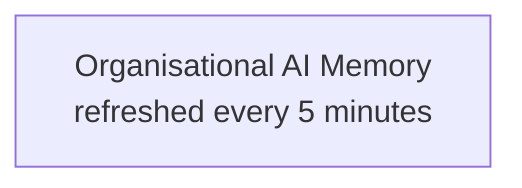
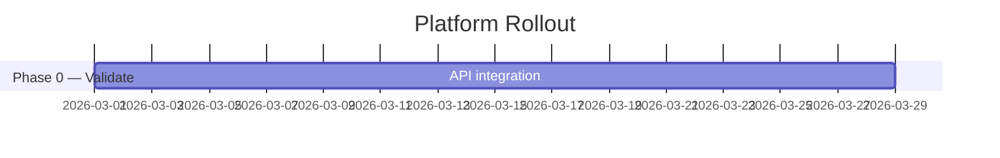

# Mermaid Obsidian Conventions

Rules for writing Mermaid diagrams that render correctly in Obsidian.

## Line Breaks in Node Labels

**Never use `\n` or `<br/>` inside node labels.** Both render as literal text in Obsidian.

Use an actual newline inside the quoted string:



The closing `"` must be on a separate line if the label spans multiple lines. Keep the label lines at the same indentation level as the rest of the diagram.

## Graph Direction

Use `graph TB` (top-bottom) or `graph LR` (left-right). Both render correctly in Obsidian. Avoid `graph TD` (identical to `TB` but less explicit).

## Gantt Charts

Always specify `dateFormat YYYY-MM`. Avoid special characters (`(`, `)`, `[`, `]`) in section labels — they can break parsing. Use plain prose for section names.



## Subgraph Labels

Double-quote subgraph labels if they contain spaces:

```mermaid
graph TB
    subgraph SRC["Your data environment"]
```

Without quotes, spaces in subgraph labels cause parse errors.

## Node ID Convention

Keep node IDs short and uppercase (e.g., `KM`, `AG`, `SRC`). Node IDs are not displayed; labels (inside `"..."`) are.

## Arrow Labels

Wrap arrow labels in double quotes when they contain spaces or special characters:

```
SRC -->|"Secure read — data stays in region"| KM
```
