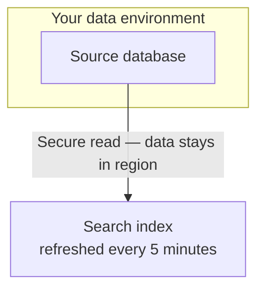

# Mermaid Obsidian Conventions

- **No `\n` or ` ` in node labels** — both render as literal text. Use a real newline inside the quoted string, closing `"` on its own line, label lines at the diagram's indentation.
- **`graph TB` or `graph LR`** — avoid `graph TD` (identical to `TB`, less explicit).
- **Gantt: always `dateFormat YYYY-MM`** — no `(`, `)`, `[`, `]` in section labels, they break parsing; use plain prose section names.
- **Double-quote subgraph labels containing spaces** — unquoted spaces cause parse errors.
- **Double-quote arrow labels containing spaces or special characters.**
- **Short uppercase node IDs** (`SRC`, `IDX`, `API`) — IDs are not displayed, the quoted label is.

```mermaid
graph TB
    subgraph SRC["Your data environment"]
        DB["Source database"]
    end
    IDX["Search index
refreshed every 5 minutes"]
    DB -->|"Secure read — data stays in region"| IDX
```
