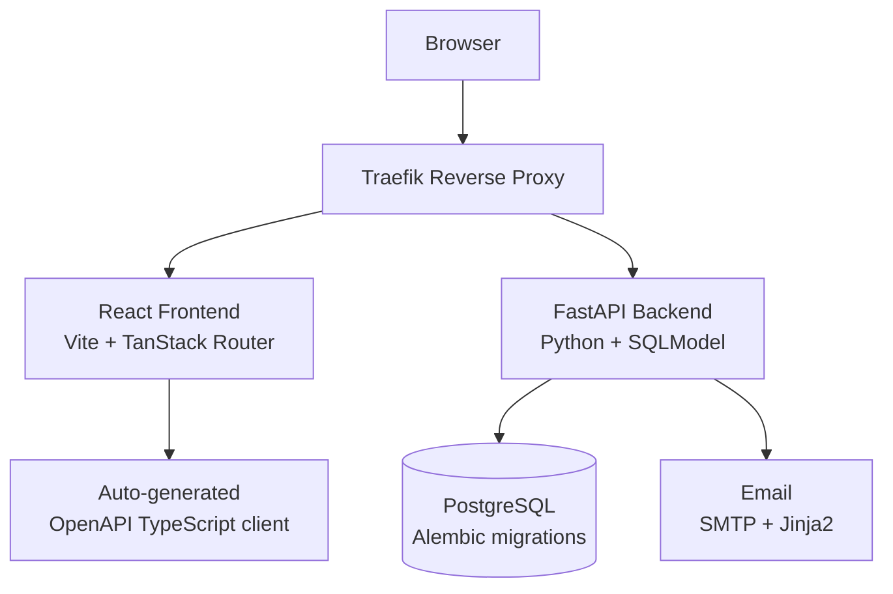

# FastAPI Fullstack Skill

**Trigger:** Use when asked to scaffold a full-stack web application with a separate frontend and backend, user authentication, a relational database, and production infrastructure (Docker, CI/CD).

**When to use fullstack vs minimal:**
- **Fullstack** → multi-user app, OAuth/JWT auth, PostgreSQL, Docker, CI/CD, React frontend with routing
- **Minimal** → single-service API, SQLite, no frontend, quick prototype, lightweight dev loop

See `skills/fastapi-minimal/SKILL.md` for the lightweight alternative.

## Locations

- `skills/fastapi-fullstack/scripts/init-fullstack.sh` — clones and renames the official template

## Prerequisites

The following must be available:

| Tool | Purpose | Install |
|------|---------|---------|
| `git` | Clone template | system package manager |
| `uv` | Python backend | `curl -LsSf https://astral.sh/uv/install.sh \| sh` |
| `bun` | Frontend | `curl -fsSL https://bun.sh/install \| bash` |
| `docker` + `docker compose` | Run stack | Docker Desktop or Docker Engine |

## Running Scripts

```bash
bash skills/fastapi-fullstack/scripts/init-fullstack.sh <project-name>
```

## What the Init Script Does

1. Validates required argument (`<project-name>`) — exits with error if missing
2. Checks prerequisites (`git`, `uv`, `bun` or `node`)
3. Clones `https://github.com/fastapi/full-stack-fastapi-template` into `<project-name>/`
4. Removes `.git/` and runs `git init` (fresh repo, no upstream)
5. Renames the project throughout:
   - `pyproject.toml`: project name
   - `compose.yml` / `compose.override.yml`: container/service names
   - Backend package directory rename + import updates
6. Generates `.env` from `.env.example`:
   - `SECRET_KEY` auto-generated via `openssl rand -hex 32`
   - `POSTGRES_PASSWORD`, `FIRST_SUPERUSER`, `FIRST_SUPERUSER_PASSWORD` prompted interactively
7. Prints next steps

## Stack Architecture



## Backend Stack

| Component | Library | Purpose |
|-----------|---------|---------|
| API framework | FastAPI | Async HTTP, OpenAPI auto-docs |
| ORM / validation | SQLModel + Pydantic v2 | Models + schema in one |
| Database | PostgreSQL | Primary data store |
| Migrations | Alembic | Schema versioning |
| Config | pydantic-settings | All config from env vars |
| Auth | JWT + passlib (bcrypt/argon2) | Password hashing + tokens |
| Emails | emails + Jinja2 | Transactional email templates |
| Error tracking | Sentry | Production error monitoring |
| Package manager | uv | Fast Python dependency resolution |

## Frontend Stack

| Component | Library | Purpose |
|-----------|---------|---------|
| Framework | React + Vite | SPA with HMR |
| Routing | TanStack Router | Type-safe file-based routing |
| Data fetching | TanStack Query | Server state + caching |
| UI components | shadcn/ui + Tailwind | Design system |
| Code style | Biome | Linting + formatting (replaces ESLint/Prettier) |
| E2E tests | Playwright | Browser automation tests |
| API client | Auto-generated | From OpenAPI schema (`openapi-ts`) |

## Infrastructure

| Component | Tool | Purpose |
|-----------|------|---------|
| Containers | Docker Compose | Local dev + production |
| Reverse proxy | Traefik | SSL termination + routing |
| CI/CD | GitHub Actions | Test + deploy pipeline |

## Workflow After Init

```bash
cd <project-name>

# Install dependencies
uv sync                    # Python backend deps
cd frontend && bun install # Frontend deps && cd ..

# Start the full stack (requires Docker)
docker compose up -d

# Access
# Frontend: http://localhost:5173
# Backend API docs: http://localhost:8000/docs
# Adminer (DB): http://localhost:8080
```

## Key Config Variables (`.env`)

| Variable | Purpose |
|----------|---------|
| `SECRET_KEY` | JWT signing key (auto-generated) |
| `POSTGRES_PASSWORD` | Database password |
| `FIRST_SUPERUSER` | Admin email |
| `FIRST_SUPERUSER_PASSWORD` | Admin password |
| `SMTP_*` | Email settings (optional) |
| `SENTRY_DSN` | Error tracking (optional) |
| `DOMAIN` | Production domain for Traefik |

## Regenerating the TypeScript Client

After any backend route/schema change:

```bash
cd <project-name>
docker compose up -d backend  # ensure backend is running
cd frontend
bun run generate-client        # re-runs openapi-ts against localhost:8000/openapi.json
```

## Alembic Migrations

```bash
# Create a migration after changing SQLModel models
docker compose run --rm backend alembic revision --autogenerate -m "add user table"

# Apply migrations
docker compose run --rm backend alembic upgrade head
```
